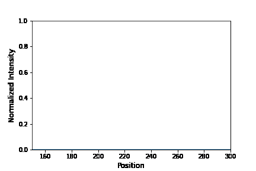

# Detecting Change in Intensity of Color in a Video

Detecting changes over time in a video is important for many fields of study. Whether it be detecting an obeject changing shape, size, or color, this concept is universal in many kinds of analyses. In this tutorial, the intensity of blue of an electrochromic material, PEDOT:PSS, is observed and plotted dynamically. The term "electrochromic" describes a certain class of materials that change color when a voltage is applied. These materials are important for various applications including biosensing and smart windows. In this tutorial, a video is shown where a PEDOT:PSS film is initially transparent. Upon applying a voltage (roughly halfway through the video), the film  changes blue. The film became transparent again once the voltage was removed. Although detecting change in color intensity over time is generally useful, this particular analysis can be useful in several ways specifically for materials scientists. For example, analyses such as this one can provide valuable information including how ions move in the bulk of the PEDOT:PSS film.

## The Data

In this tutorial, the data is the following video. 

Figure 1: Video of PEDOT:PSS film chagning color after a voltage is applied (color change is in roughly 10 seconds after video begins).

The PEDOT:PSS film is initially transparent and becomes blue as a voltage is applied. After the voltage is removed, the film becomes transparent again. This information, along with the cv2 library in python, can be used to analyze this video in more depth. 

## Image and Video Analysis

One way of being able to tell when the voltage is being applied (and hence the film is changing color) is by applying a mask to each frame in the video. The maks works in the following way. Based on a certain range in the HSV color model, only blue pixels will be left in an image. The rest of the pixels will be blacked out. In addition, the HSV values of the blue pixels for each image can then be used to quantify the intnsity of blue over time in the video. After this step, the data for the blue pixel intensity over time can be presented in many ways. In this tutorial, a dynamic plot was generated with the data and is shown below.

Figure 2: Dynamic plot demonstrating how the intensity of the blue film changes over time.